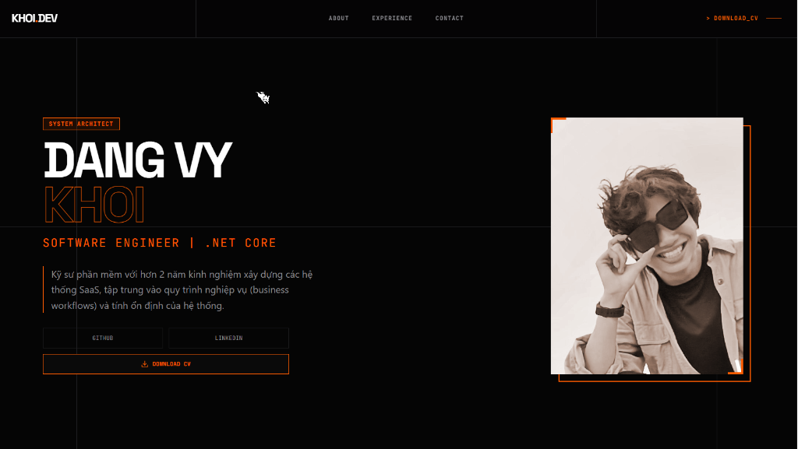
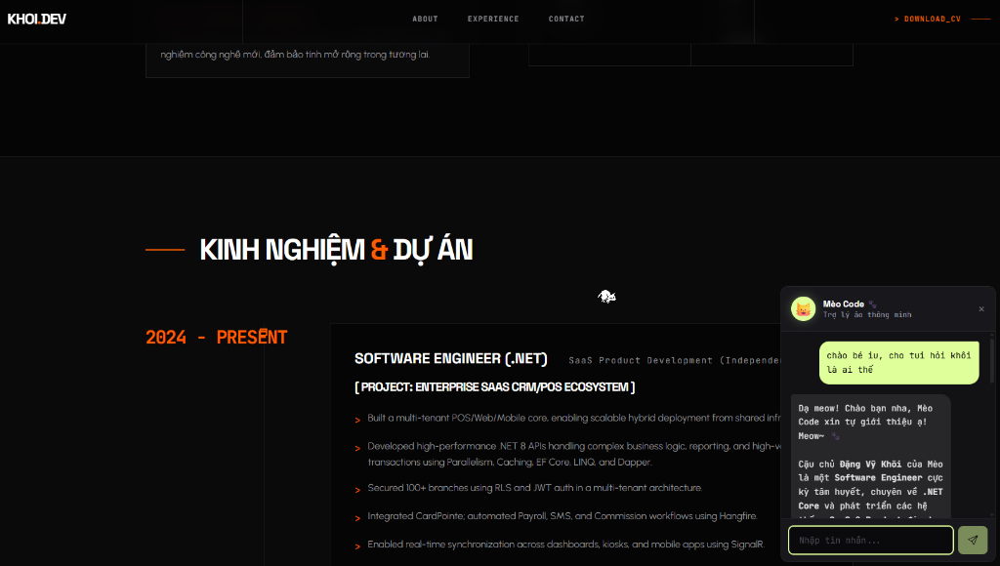
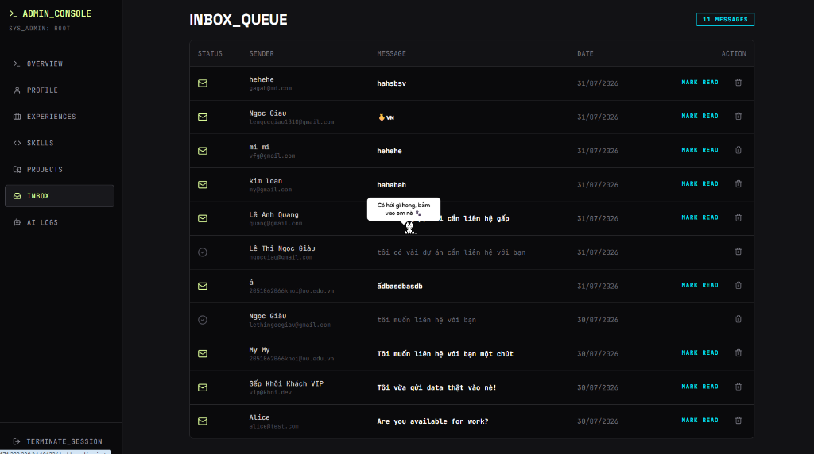

# 🚀 Khoi's Portfolio & Tech Playground

Chào mừng bạn đến với repository chứa mã nguồn trang web Portfolio cá nhân của mình - **Đặng Vỹ Khôi**! 👋

Đây không chỉ là một chiếc Portfolio tĩnh dùng để trưng bày CV thông thường, mà còn là **"phòng thí nghiệm" (lab) cá nhân** của mình. Mình xây dựng dự án này với mục đích vừa làm một sản phẩm thực tế để phục vụ công việc, vừa làm sân chơi để thoải mái **vọc vạch, tập luyện và thử nghiệm** những công nghệ backend / frontend mới nhất.

## 🛠️ Có gì vui trong repo này?

Dưới đây là một số hình ảnh demo sơ lược về dự án:

| Trang Chủ | Trợ Lý AI Mèo Code | Admin Dashboard |
| :---: | :---: | :---: |
|  |  |  |

Dù chỉ là Portfolio cá nhân, nhưng mình đã "chơi lớn" setup hẳn một kiến trúc rất gì và này nọ để học tập:
- **Frontend:** Giao diện tương tác mượt mà, thiết kế hiện đại, có tích hợp AI Chatbot (Mèo Code) siêu cute để trò chuyện với nhà tuyển dụng.
- **Backend:** Xây dựng theo hướng Microservices siêu nhỏ gọn với `.NET Core`, có sử dụng cơ sở dữ liệu `PostgreSQL`.
- **Đồ chơi xịn xò:** Tích hợp `Docker`, `Telegram Bot` (báo tin nhắn realtime khi có khách chat), tích hợp `Gemini AI`...

## 🌱 Dành cho những ai ghé thăm
Nếu bạn vô tình đi ngang qua repo này, thấy hứng thú thì **cứ thoải mái clone về, tải về xem code, chạy thử hoặc vọc vạch tùy thích nhé!** 

Code trong này có thể không phải là những dòng code hoàn hảo nhất thế giới, nhưng nó là quá trình mình học hỏi, sai và sửa mỗi ngày. Hy vọng nó có thể giúp ích được chút gì đó cho hành trình học tập của bạn, hoặc đơn giản là mang lại cho bạn một chút niềm vui khi khám phá! 😸

## 📬 Kết nối với mình
Nếu bạn muốn trao đổi về code, hoặc có nhã ý muốn mời mình về team:
- **Email:** dangvykhoi@gmail.com
- **Điện thoại:** 0931 31 47 92

---
*Code with ❤️ and lots of ☕ by Khoi Dang*
