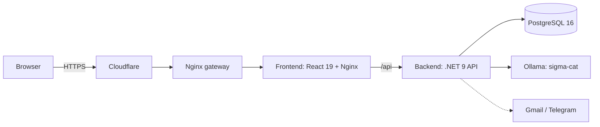

<div align="center">

# Đặng Vỹ Khôi (Dang Vy Khoi) — Portfolio

**Software Engineer (.NET Backend)**

[](https://dangvykhoi.com)
[](https://linkedin.com/in/vykhoi)
[](https://github.com/vykhoi)

`.NET 9` · `PostgreSQL 16` · `React 19` · `TypeScript` · `Tailwind` · `Ollama (Qwen2.5)` · `Docker` · `Nginx`

</div>

A personal website self-hosted on a home server: a public profile, an admin console for editing the content, and **Sigma Cat** 😼, an AI assistant that runs locally.

| Home | Sigma Cat AI assistant | Admin dashboard |
| :---: | :---: | :---: |
|  |  |  |

## Architecture


```mermaid
graph LR
    U["Browser"] -->|"HTTPS"| CF["Cloudflare"]
    CF --> GW["Nginx gateway"]
    GW --> FE["Frontend: React 19 + Nginx"]
    FE -->|"/api"| BE["Backend: .NET 9 API"]
    BE --> DB[("PostgreSQL 16")]
    BE --> AI["Ollama: sigma-cat"]
    BE -.-> N["Gmail / Telegram"]
```

- **Backend:** .NET 9 modular monolith, EF Core, JWT, in-memory cache, background email through `System.Threading.Channels`.
- **AI:** Ollama + Qwen2.5 1.5B, reachable only inside the Docker network. Its knowledge lives in `src/Portfolio.AI`. Common questions get an instant answer (Fast Intent); the rest stream over SSE.
- **Frontend:** React 19, Vite, Tailwind, Framer Motion; SEO with JSON-LD, OpenGraph and a sitemap.
- **Protection:** rate limits, a honeypot against bots (no captcha), secrets managed on the server.

More detail: [docs/ARCHITECTURE.md](docs/ARCHITECTURE.md) · [docs/DEV_GUIDE.md](docs/DEV_GUIDE.md)

## Run it locally

```bash
git clone https://github.com/vykhoi/Portfolio.git && cd Portfolio
cp .env.example .env
docker volume create ollama_models
docker compose up -d --build
./src/Portfolio.AI/scripts/build-model.sh      # Windows: .\src\Portfolio.AI\scripts\build-model.ps1
```

Open http://localhost:18122. pgAdmin (optional): `docker compose --profile tools up -d pgadmin` → http://127.0.0.1:5050.

## Contact

📧 [dangvykhoi@gmail.com](mailto:dangvykhoi@gmail.com) · 🌐 [dangvykhoi.com](https://dangvykhoi.com) · 💼 [linkedin.com/in/vykhoi](https://linkedin.com/in/vykhoi)
