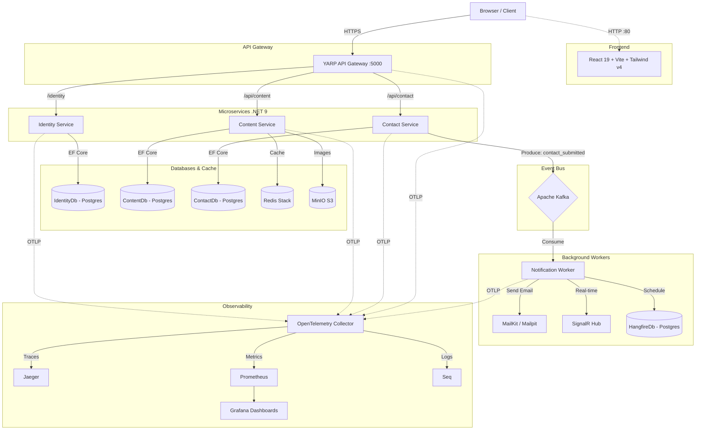

# System Architecture (Portfolio Project)

## 1. Overview
The Portfolio project is a modern, cloud-native application built using a **Microservices Architecture**. It serves as both a public portfolio showcasing skills/projects and a private admin dashboard for content management.

## 2. Component Diagram

## 3. Key Design Decisions
- **CQRS Pattern**: Used heavily in microservices via MediatR to separate Read and Write operations.
- **Database-per-Service**: Each microservice owns its PostgreSQL database (isolated schemas/databases) to prevent tight coupling.
- **Event-Driven**: Asynchronous tasks like sending emails are handled via Kafka to decouple the fast API responses from slow external dependencies.
